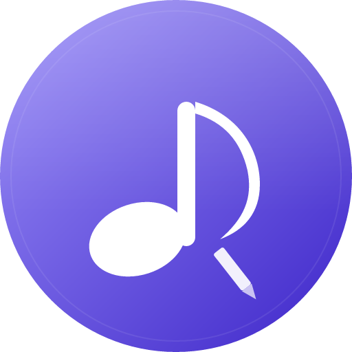

<div align="center">



# AudioNote

**Local-first music catalog, annotation, and live timestamp tool**

[](https://github.com/LIBCSYS/audionote/releases)
[](https://nodejs.org)
[](https://nodejs.org/api/sqlite.html)
[](LICENSE)
[](#)
[](https://audionote.je9.us)

[Features](#-features) · [Try It Live](#-try-it-live) · [Quick Start](#-quick-start) · [How It Works](#-how-it-works) · [Customization](#-customization) · [Roadmap](#-roadmap)

---

*A [TheRatsAsses](https://theratsasses.com) Music Release — dba [LibCSystems](https://libcsys.com)*

</div>

---

## What is AudioNote?

AudioNote is a **local-first** audio catalog and annotation tool. Point it at a folder of audio files, and it gives you a clean browser interface to play tracks, write notes, and drop **live timestamp markers** while you listen — all stored in a local SQLite database that never leaves your machine.

It is not a streaming service. It does not sync to the cloud. It does not require an account. It is yours.

---

## ✨ Features

| | |
|---|---|
| 🎵 **Catalog** | Recursively scans one or more folders for `.mp3` files, reads ID3 tags (title, artist, album, duration) |
| ▶️ **Player** | Full-featured HTML5 audio player — seek, volume, progress bar — right in the browser |
| ⏱ **Timestamp markers** | Press **Mark** (or hit `M`) while a track plays to pin the exact moment. Add a label after. Click any marker to jump back. |
| 📝 **Song notes** | Freetext notes per track, auto-saved as you type |
| 📁 **Multi-folder** | Add any number of scan folders; AudioNote remembers them across restarts. Rescan adds new files and soft-removes missing ones. |
| 🔖 **Annotated filter** | Tracks with notes get a 📝 flag in the sidebar. One-click **Noted only** filter. |
| ✏️ **Rename on disk** | Rename the actual `.mp3` file from the player — no file manager needed |
| 🗑 **Soft delete** | Remove a track from the library without touching the file. Notes and timestamps are preserved in the database forever. |
| ⬇️ **CSV export** | Export your full catalog — notes and all timestamps — as a UTF-8 CSV ready for Excel or database import |
| 💬 **Ask AudioNote** | Built-in AI chat assistant answers questions about your library and how the app works |
| 🌐 **Network access** | Binds to `0.0.0.0`; accessible from any machine on your local network or VPN |
| 🖥️ **Web mode** | Public demo at [audionote.je9.us](https://audionote.je9.us) — pick files directly from your browser, nothing uploaded |

---

## 🌐 Try It Live

**[https://audionote.je9.us](https://audionote.je9.us)**

The hosted demo runs in your browser using the [File System Access API](https://developer.mozilla.org/en-US/docs/Web/API/File_System_API). Click **🎵 Add Files**, select some MP3s from your machine, and the full AudioNote experience runs instantly — no install, no upload, nothing leaves your device.

> **Best results:** Install locally (see below). The web demo is great for trying it out, but the local install gives you persistent library scanning, full library size support, and notes that survive across every session without picking files again.

Requires Chrome or Edge. Safari does not support the File System Access API.

---

## 🚀 Quick Start

### Requirements

- **[Node.js 22.5+](https://nodejs.org)** — uses the built-in `node:sqlite` module, no native compilation required.

### Install

```bash
git clone https://github.com/LIBCSYS/audionote
cd audionote
```

Place the cloned folder **inside** your music directory. AudioNote scans its **parent folder** for MP3 files by default, so the layout should look like this:

```
your-music-folder/
├── audionote/          ← the cloned repo lives here
│   ├── app.js
│   └── ...
├── song1.mp3
├── artist-folder/
│   └── song2.mp3
└── ...
```

Then install and run:

```bash
npm install
node app.js
```

Open **[http://localhost:2600](http://localhost:2600)** and click **↻ Rescan Library** to populate your catalog.

---

## 🔍 How It Works

AudioNote is a **Node.js / Express** server that runs on your machine. The browser is just a UI.

```
your-music-folder/
├── audionote/
│   ├── app.js          → Express server, all API routes
│   ├── db.js           → SQLite schema + connection (node:sqlite built-in on Node 22.5+)
│   ├── audionote.db    → your catalog, notes, timestamps (gitignored)
│   └── public/
│       ├── index.html  → single-page UI
│       ├── style.css
│       └── client.js   → vanilla JS, no framework
└── your mp3s ...
```

**On Rescan**, AudioNote walks your configured folders, finds every `.mp3`, reads its ID3 tags via `music-metadata`, and writes new entries into `audionote.db`. Missing files are soft-deleted (record preserved, `deleted_at` stamped). Your existing notes and timestamps are never touched.

**Audio streaming** uses HTTP range requests so seeking works instantly without buffering the whole file.

**Your data is yours.** `audionote.db` is gitignored. The repo ships completely blank.

---

## 🛠 Customization

Edit the top of `app.js` or pass environment variables:

| Variable | Default | Description |
|---|---|---|
| `PORT` | `2600` | Port the server listens on |
| `MUSIC_ROOT` | `path.join(__dirname, '..')` | Fallback folder if no scan dirs are configured |

```bash
PORT=2600 node app.js
PORT=2600 MUSIC_ROOT=/path/to/music node app.js
```

### Windows Firewall (for network access)

```
netsh advfirewall firewall add rule name="AudioNote" dir=in action=allow protocol=TCP localport=2600
```

---

## 📊 CSV Export Format

Click **⬇ Export CSV** in the sidebar. The download is UTF-8 with BOM (opens cleanly in Excel on Windows) and Windows line endings.

One row per timestamp. Tracks with notes but no timestamps still get a row.

| Column | Description |
|---|---|
| `song_id` | Internal ID |
| `title` / `artist` / `album` | ID3 tag data |
| `duration_sec` / `duration_formatted` | e.g. `214.5` / `3:34` |
| `filepath` | Full path on disk |
| `note` | Your song note text |
| `timestamp_id` | Internal ID |
| `time_seconds` / `time_formatted` | e.g. `102.4` / `1:42` |
| `label` | Your marker label |
| `category` | Reserved for future vocal/riff classification |
| `marked_at` / `cataloged_at` | ISO datetimes |

---

## 🗺 Roadmap

- [x] Web demo — browser-native via File System Access API ([audionote.je9.us](https://audionote.je9.us))
- [x] AI chat assistant (Ask AudioNote)
- [x] Multi-format support in web mode (MP3, M4A, WAV, FLAC, OGG, AAC)
- [ ] Multi-format support in local mode (FLAC, WAV, AAC, M4A)
- [ ] CSV import
- [ ] Vocal line tabulation and markup
- [ ] Chord / riff transposition tools
- [ ] Playlist / queue support
- [ ] Dark / light theme toggle

---

## License

MIT — do whatever you want with it.

---

<div align="center">


*A [TheRatsAsses](https://theratsasses.com) Music Release — dba LibCSystems · © 2026 LibCSystems LLC*

</div>
